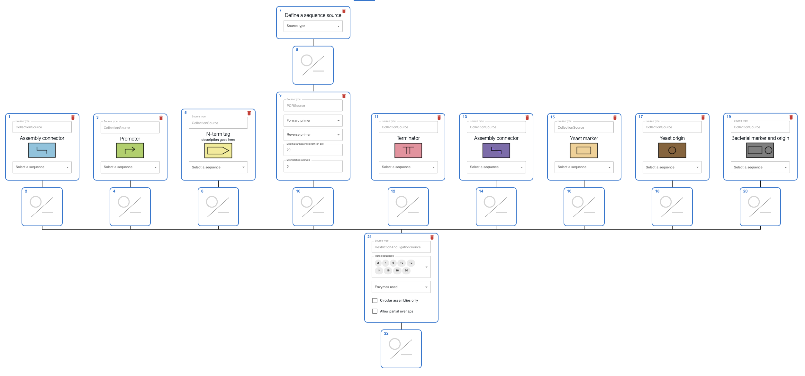
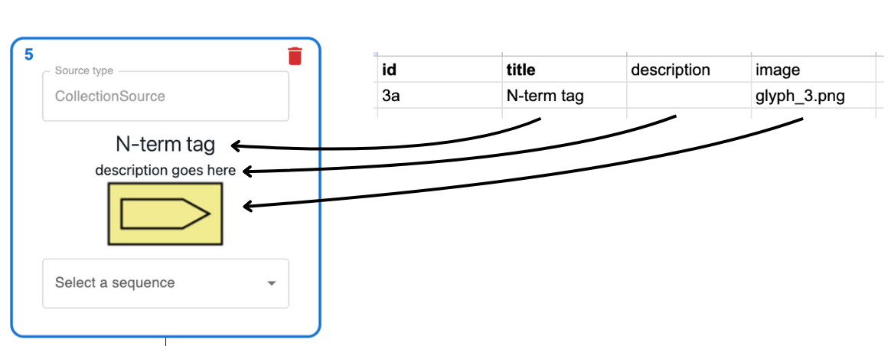
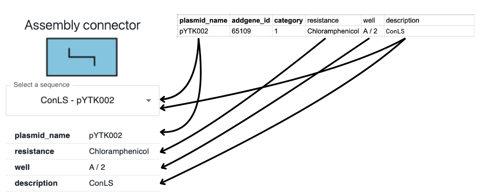
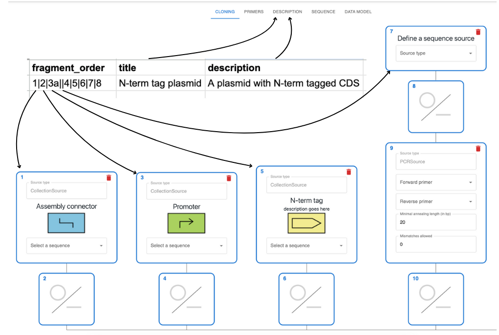

> **NOTE:** This assembly pipeline was thought for MoClo kits. If you want to submit a different type of kit, create an issue in this repository, or [send me an email](manuel.lera-ramirez@ucl.ac.uk) 📧.

# How to submit 📝

You can submit an AddGene kit to generate a series of templates in [OpenCloning](https://opencloning.org/). Let's take as an example the [MoClo YTK kit](https://www.addgene.org/kits/moclo-ytk/). You can load one of the associated templates by going to [OpenCloning](https://opencloning.org/) and clicking on `Examples` > `MoCloYTK` > `N-term tag plasmid`. This will load a template for a cloning strategy that will look more or less like this:

By submitting a simple spreadsheet and optionally some images, the submission pipeline 🤖 will generate equivalent [cloning templates](https://github.com/genestorian/shareyourcloning-submission/tree/main/processed/kits-moclo-ytk/templates) for the submitted kit. 🧬

Submitting a kit is very easy 📦, you just need to fill a google sheet 📋 with the information of the kit 🧰, and upload through a form 🚀.

Below we explain what an example submission spreadsheet looks like and how to prepare your submission.

## Understanding the submission spreadsheet 📊

Open the [example submission google sheet](https://docs.google.com/spreadsheets/d/1u54WUnWq99lchTnQEmboktpDHeiILHor4ZA0gnr8yik/edit?usp=sharing). Each sheet represents different aspects of the kit submission, each sheet is described below:

### Category 📂

In MoClo kits, plasmids are grouped into categories according to the type of part they contain (promoters, terminators, CDS, etc.). The table below shows some categories of the MoClo YTK kit.

| id  | title              | description | image       |
| --- | ------------------ | ----------- | ----------- |
| 1   | Assembly connector |             | glyph_1.png |
| 2   | Promoter           |             | glyph_2.png |
| 3   | Coding sequence    |             | glyph_3.png |
| 3a  | N-term tag         |             | glyph_3.png |

* `id`: The unique identifier of the category. In MoClo, these are combinations of numbers and letters (plasmid of type `1`, type `3a`, etc.). These are unique identifiers of the type of part.
* `title`: The name of the category.
* `description`: A description of the category (optional).
* `image`: An image that represents the category (optional). You will have to upload this image in the submission pipeline.

This is how these columns map to what you see in the cloning template:

### Sequence 🧬

This table contains the info of the plasmids that are part of the kit (😮‍💨 don't worry, you won't have to type it yourself!). It looks like this:

| name    | addgene_id | category | resistance      | well  | description |
| ------- | ---------- | -------- | --------------- | ----- | ----------- |
| pYTK002 | 65109      | 1        | Chloramphenicol | A / 2 | ConLS       |
| pYTK003 | 65110      | 1        | Chloramphenicol | A / 3 | ConL1       |

* `name`: The name of the plasmid in AddGene.
* `addgene_id`: The AddGene ID of the plasmid (it's in the url of the addgene page, for instance 65109 for [pYTK002](https://www.addgene.org/65109/)).
* `category`: The category of the plasmid. This matches an `id` from the `Category` sheet.
* `description`: A description of what the plasmid contains.
* Other categories: You can add more columns to this table to include more information about the plasmids. They will be displayed in the info table, like `well` in the example below.

This is how these columns map to what you see in the cloning template (select a sequence from the dropdown in the website to see this). Note how the options of the dropdown are composed of the `description` and the `name`:

### Assembly 🧩

Each row in this table represents a possible type of assembly that can be performed with the kit and will be turned into a cloning template. Below we see the row corresponding to the `N-term tag plasmid` assembly that we loaded in the example:

| fragment_order            | title              | description                      |
| ------------------------- | ------------------ | -------------------------------- |
| 1\|2\|3a\|\|4\|5\|6\|7\|8 | N-term tag plasmid | A plasmid with N-term tagged CDS |

* `fragment_order`: The order in which the type of parts are assembled. Each part is separated by a `|`. The parts are the `id` of the categories in the `Category` sheet (😮‍💨 don't worry, you will not have to type this yourself!).

    In this example, we have a an assembly that starts with `1` (Assembly connector), followed by `2` (Promoter), `3a` (N-term tag), etc. Note that there is an empty `||` in the middle, that represents a part that is not defined in the kit and that the user will provide (see the 4th lane in the image below).
* `title`: The title of the assembly. Will be shown in the `Description` tab of OpenCloning.
* `description`: More details about this type of assembly.

### Kit 🧰

Contains info of the kit.

| pmid          | addgene_url                             | title     | description                                      |
| ------------- | --------------------------------------- | --------- | ------------------------------------------------ |
| PMID:25871405 | https://www.addgene.org/kits/moclo-ytk/ | MoClo YTK | Golden-gate based modular cloning kit for yeast. |

* `pmid`: The PMID (PubMed unique identifier) of the publication associated with the kit. You can get this by searching the publication in PubMed and copying the number from the url. For example, https://pubmed.ncbi.nlm.nih.gov/25871405/ has a corresponding `PMID:25871405`.
* `addgene_url`: The url of the kit in AddGene.
* `title`: The title of the kit.
* `description`: A description of the kit.

### Submitter 🙋

Contains info of the submitters of this spreadsheet (you!). You can add several rows. Only the `full_name` is required, but you can add the other fields to get further credit for your submission.

| full_name           | orcid               | github_username |
| ------------------- | ------------------- | --------------- |
| Manuel Lera-Ramirez | 0000-0002-8666-9746 | manulera        |

## Preparing your submission 🛠️

> **NOTE:** the submission site is hosted in a free service, so the first time you access it, it might take a while to load (around a minute 😴). Once it loads for the first time, it should be faster. You can start waking it up by [opening it already](https://shareyourcloning-submission.onrender.com/).

Start by making a copy of the [submission template](https://docs.google.com/spreadsheets/d/1Oooxchf1NBEnNgzqXbsoeTGa1fzuU0AsPR56HB5zBEo/edit?usp=sharing)📋. You will fill up the info about your submission there.

Compulsory fields have bold headers. You won't be able to submit the form if you don't fill them. The rest of the fields are optional, but the more information you provide, the better the templates will be!

### Getting the AddGene kit info 🧬

1. Copy the url of the addgene kit you want to submit
2. Paste it in [this form](https://shareyourcloning-submission.onrender.com/get_kit_info), submit and download the resulting tsv file. The file looks like the table below:

    | name    | addgene_id | category | resistance      | well  | description |
    | ------- | ---------- | -------- | --------------- | ----- | ----------- |
    | pYTK001 | 65108      |          | Chloramphenicol | A / 1 |             |
    | pYTK002 | 65109      |          | Chloramphenicol | A / 2 |             |
    | pYTK003 | 65110      |          | Chloramphenicol | A / 3 |             |

    > Note how the columns `category` (see above what category represents) and `description` (the name of the part that the plasmid contains) are empty. We cannot get this information from AddGene 😢, and you may have to fill those by hand, but we can sometimes get this information from the publication, see next section.

3. Load the tsv file you downloaded into the submission template:
   * Go to the `Sequence` sheet in the example submission, select the cell `A2`.
   * Click on `File` > `Import` > `Upload`.
   * Select the tsv file you downloaded.
   * In `Import location` select `Append to current sheet`
   * Uncheck `Convert text to numbers and dates`
   * Click on `Import data`. This will load the data into the sheet.
   * Delete the first imported row (it's the header of the tsv file).

4. Delete any rows that contain plasmids that are not used in assemblies. For instance, in the MoClo YTK kit, the plasmids `pYTK001` and `pYTK096` contain the empty vector and an assembled one. They are not used in any assembly, so we can delete them.
5. Fill the `category` and `description` columns by hand or by getting the information from the publication (see below).
6. You can also add extra columns to the `Sequence` sheet to include more information about the plasmids, they will be displayed in the info table as in the picture.

#### Getting the category and description from the publication 📖

You need a table from a publication in which either of the columns `name`, `addgene_id`, or `well` are present (even if the column name does not match). For the [MoClo YTK publication](https://pubs.acs.org/doi/10.1021/sb500366v), the supplementary material contains a spreadsheet with information of the plasmids, the table looks like this:

| Plasmid | Part Type    | Part Description          | E. coli Antibiotic Marker | Plasmid Sequence |
| ------- | ------------ | ------------------------- | ------------------------- | ---------------- |
| pYTK001 | entry vector | Part Plasmid Entry Vector | Chloramphenicol           | ...              |
| pYTK002 | 1            | ConLS                     | Chloramphenicol           | ...              |
| pYTK003 | 1            | ConL1                     | Chloramphenicol           | ...              |

> **NOTE**: If the table is in a pdf, you can use [adobe's pdf-to-excel](https://www.adobe.com/uk/acrobat/online/pdf-to-excel.html) to convert it to a spreadsheet online (it's better to edit the pdf to keep only the pages that include the table). They may ask you to create an account if you try more than once, but you can use incognito mode 🕵️. You can also use [tabula](https://tabula.technology/).

In google sheets you can easily merge the two tables by using the `VLOOKUP` function. In the [example submission](https://docs.google.com/spreadsheets/d/1u54WUnWq99lchTnQEmboktpDHeiILHor4ZA0gnr8yik/edit?usp=sharing) you can see how to use this formula.

Go to the sheet `extra_info` in the example. It contains the supplementary table from the publication. To fill the `category` and `description` columns in the `Sequence` sheet, see the formula in the `category` column of the `Sequence` sheet. In the first cell, it contains `=VLOOKUP(A2,extra_info!A:D,2,FALSE)`:
* `A2` is the `name` cell in the first row of the `Sequence` sheet.
* `extra_info!A:C` specifies the columns of the table in sheet `extra_info` that we want to get information from.
* Finally, `2` specifies that we want to get the information from the second column of the table in `extra_info`.
* `VLOOKUP` will look for the value in `A2` in the table in `extra_info`, and return the value in the second column of the table in `extra_info`.
* The same is done for the `description` column, but with `=VLOOKUP(A2,extra_info!A:D,3,FALSE)` instead.

You can do the same thing for your submission:
1. Create an `extra_info` sheet in your submission template
2. Paste the table from the publication in there
3. Use the `VLOOKUP` function to fill the `category` and `description` columns in the `Sequence` sheet.
4. Drag the formula down to fill all the rows.

### Filling the category sheet 📂

1. Go to the `Category` sheet. What? 😮 Someone has pre-filled the category ids you! ✨✨. The `id` column contains all unique values in the `category` column of the `Sequence` sheet.
2. Fill the sheet. Only the `title` is necessary, but `description` can be useful for parts that need further explanation.
3. If you are submitting images for the categories, make sure the image file names match what you write in the `image` column. You will have to upload the images in the submission pipeline.

### Filling the assembly sheet 🧩

1. Go to the `assembly_grid` sheet. Each row represents a type of assembly that can be performed with the kit.
1. In each row, you can select the categories that constitute a certain type of assembly. This will be used to fill the `fragment_order` column in the `Assembly` sheet.

    Select the categories in the dropdowns in the order they will be assembled. If there is a place in the assembly where you will have to insert a part that is not defined in the kit, you can leave an empty cell (see the example [above](#assembly-)).
2. Do a row for each type of assembly you want to generate.
3. Go back to the `Assembly` sheet.
4. Verify that the `fragment_order` column looks ok.
5. Fill the `title` and `description` columns.

### Filling the kit and submitter sheets 🧰🙋

Fill the `Kit` and `Submitter` sheets with the information of the kit and the submitters.

### Submitting the form 🚀

🎉 You did it 🎉. Go to the [submission site](https://shareyourcloning-submission.onrender.com/) and upload your submission template.

> **NOTE:** the submission site is hosted in a free service, so the first time you access it, it might take a while to load (around a minute 😴). Once it loads for the first time, it should be faster.

